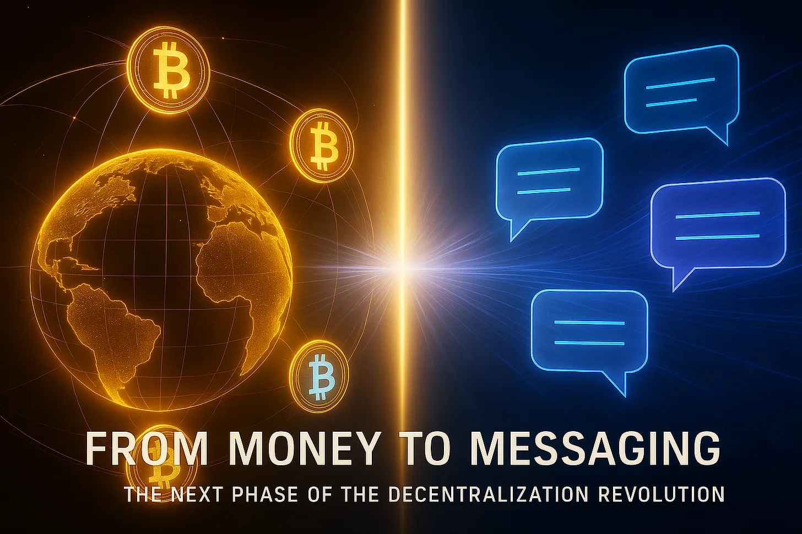

## Introduction

In 2009, [Bitcoin](https://bitcoin.org/en/bitcoin-paper) introduced more than a new kind of currency, it introduced a new kind of trust. For the first time in history, financial transactions could be secured, validated, and verified without banks, clearing houses, or any central authority. The mechanism was not institutional but mathematical: open-source code, cryptographic proof, and consensus among peers.

15 years later, those same principles: *transparency, decentralization, and verifiability*, are beginning to migrate from money to *communication*. If Bitcoin separated value from the banking system, the next revolution aims to separate speech from the platforms that control it.

## 1. Bitcoin’s True Innovation: Trust Without Intermediaries

To call Bitcoin merely “digital money” is to miss the point. Digital currencies existed long before 2009. What Bitcoin introduced was a *network architecture that made trust optional*. Its source code was public, so anyone could examine or modify it. Transactions were verified not by institutional reputation but by mathematical consensus. The system had no gatekeepers; participation required no permission. This was the real breakthrough, not the token itself, but the proof that value could move without intermediaries. It was, in essence, a redefinition of economic sovereignty.

Yet even Bitcoin’s success showed the struggle between principle and practice. As adoption grew, mining power consolidated, regulation encroached, and full decentralization became harder to maintain. Still, the paradigm held: trust in proofs, not promises.

## 2. Messaging Today: The Last Centralized Frontier

By contrast, most of our communication infrastructure remains deeply centralized.

Whether it’s WhatsApp, Telegram, or Facebook Messenger, messages travel through servers owned by corporations, governed by opaque policies, and subject to state pressure. Even when “end-to-end encryption” is advertised, implementation is closed-source; users are asked to trust what they cannot verify.

Metadata (who spoke, when, from where) is often left unprotected, creating vast behavioral maps for advertisers or intelligence agencies. And history shows that [backdoors](https://www.geeksforgeeks.org/computer-networks/what-is-a-backdoor-attack/), intentional or coerced, are rarely hypothetical.

In short, today’s messaging resembles the *pre-Bitcoin financial system*: convenient, global, and utterly dependent on intermediaries whose incentives do not align with the user’s privacy.

## 3. The Emergence of Protocols: Bitcoinification of Communication

A growing number of developers are now applying Bitcoin’s architectural insights to communication itself. Rather than building yet another “app,” they are designing protocols with neutral, open layers upon which applications can be built.

These new systems share key traits with the early crypto networks:

* **No central servers:** Messages are routed peer-to-peer or across distributed nodes.

* **Open source code:** Security arises from transparency, not secrecy.

* **Trustless cryptography:** Verification replaces reliance.

* **Resilience through decentralization:** No single entity can censor, shut down, or surveil at scale.

The objective is not to compete with corporations on convenience, but to provide a decentralized alternative. In essence, this movement seeks the Bitcoinification of another fundamental dimension of human life; communication itself. Decentralized, open-source, verifiable, and trustless: communication designed to eliminate intermediaries rather than depend on them.

## 4. Why It Matters: Power, Privacy, and Human Agency

The decentralization of communication is not merely a technical improvement; it’s a defense against structural dependency. When the ability to speak or organize depends on corporate or governmental goodwill, it ceases to be a right and becomes a privilege. When code is closed, users must take privacy on faith. And faith, as history repeatedly shows, can be quietly betrayed; from Microsoft’s post-acquisition [backdoor in Skype](https://techcrunch.com/2025/03/03/as-skype-shuts-down-its-legacy-is-end-to-end-encryption-for-the-masses/) (revealed by Snowden) to recurring data-sharing scandals across Silicon Valley.

Open systems invert that dynamic. In a world where code is visible, protocols verifiable, and control distributed, users regain agency. They can audit the systems they rely on, fork them when necessary, and adapt them to their needs without waiting for permission.

In short: *decentralized money restored economic autonomy; decentralized communication restores informational autonomy.*

## 5. The Principles of a Trustless Future

If this shift is to endure, it must be built on uncompromising foundations such as end-to-end [quantum encryption](https://www.nist.gov/cybersecurity/what-post-quantum-cryptography), open source verifiability, trustless design and decentralized infrastructure.

### Quantum-Secure Cryptography

Encryption must be prepared for the next computational epoch. Algorithms like [RSA](https://www.historytools.org/concepts/rsa-encryption) and [ECC](https://www.encryptionconsulting.com/elliptic-curve-cryptography-ecc/) will one day yield to quantum attacks. Post-quantum schemes such as [CRYSTALS-Kyber](https://pq-crystals.org/kyber/) and [Dilithium](https://pq-crystals.org/dilithium/index.shtml) are already being standardized; they must become the default, not the exception.

### Open-Source Transparency

Security through obscurity is a contradiction. Privacy can only be guaranteed if anyone can inspect, test, and verify the code that enforces it.

### Trustless Design

No single entity: not a company, not a government: should hold the keys to a communication network. Integrity must arise from protocol rules, not from promises.

### Decentralized Infrastructure

Resilience depends on distribution. A network with no central point of failure cannot be silenced by decree or corrupted from within, with Bitcoin, Ethereum and other technologically mature blockchain networks operating as living proof of this. Even a well resource adversary would not be able to shut down these networks.

All of the above features are not conveniences; they are design preconditions for genuine digital freedom and communication sovereignty.

## Conclusion: From Value to Voice

Bitcoin demonstrated that value could flow freely without banks. The next revolution proves that speech can flow freely without intermediaries of control. Both rest on the same moral and technical foundation: transparency, verifiability, and decentralization. Both challenge an old order built on opacity and dependency. And both remind us that trust, once lost, can only be replaced with proof.

Decentralized finance began in 2009; decentralized communication begins now.

[Liberdus](https://liberdus.com) stands at that frontier; not merely as a messenger, but as a principle written in code: privacy, autonomy, and truth should never require permission.

---

*Welcome to the future of decentralized communications.*

