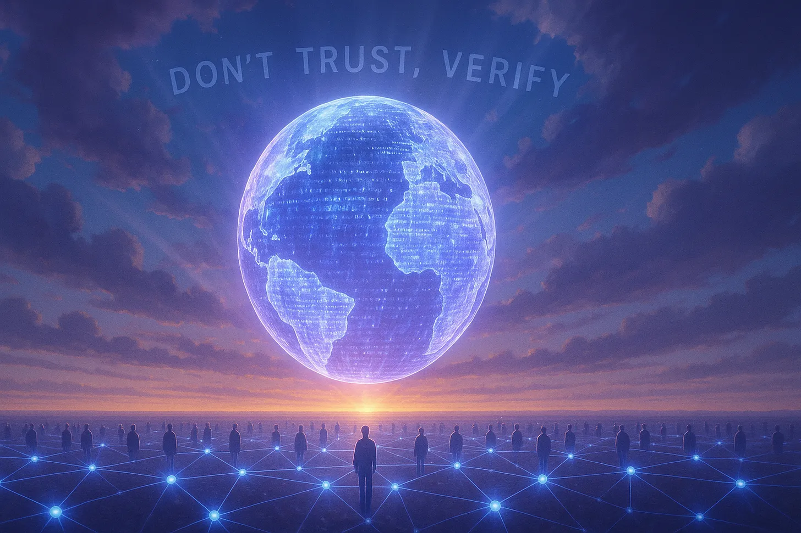

## Introduction

Encryption has long been the cornerstone of digital privacy. It transforms communication into unreadable code, shielding it from eavesdroppers and prying intermediaries. Yet encryption alone is not enough.

True security does not come merely from secrecy; it comes from verifiability. And when encryption is deployed within closed-source software, users are no longer protected by mathematics, but by faith. The history of communication technology offers a cautionary tale: one of misplaced trust, quiet compromises, and the slow erosion of privacy behind corporate firewalls.

---

## The Skype Precedent: How Closed Code Became a Backdoor

After the Microsoft acquisition, Skype’s architecture shifted toward a more centralized model. This change made it easier for authorities to issue data-access requests and years later, the Snowden disclosures showed that Microsoft had cooperated with the U.S. National Security Agency’s PRISM program, enabling government access to certain Skype communications. Earlier, in 2008, researchers at Citizen Lab had already uncovered that a Chinese-operated version of Skype (Tom-Skype) had been modified to allow state monitoring.

> “Skype’s history became a case study in how centralization invites surveillance. In 2008, Citizen Lab discovered that the Chinese version of Skype (Tom-Skype), then operated under a local joint venture, had been modified to collect and store user messages for state monitoring. After Microsoft acquired Skype, its architecture became increasingly centralized; and when the Snowden documents were released years later, they showed that Microsoft had cooperated with the NSA’s PRISM program, giving authorities access to certain Skype communications. The lesson wasn’t about one company; it was about the fragility of closed, server-dependent systems.”

---

## The Illusion of Security Without Transparency

Closed-source encryption carries a paradox: it asks users to place blind trust in systems that were invented precisely to remove the need for trust.

Even the strongest encryption protocol can be subverted if implemented in a system whose behaviour cannot be observed. A developer might add a data-logging mechanism under legal order. An update could silently insert telemetry or weaken randomness in key generation. None of this would be visible to the end user. In cryptography, opacity is not a feature; it’s a risk surface.

Open-source software, by contrast, transforms privacy into something that can be proven. Anyone can examine the code, audit the encryption libraries, and verify that what’s running on their device matches the public repository. This principle — ***“don’t trust, verify”*** — is what separates systems that rely on mathematics from those that rely on marketing.

---

## The New Frontier: Quantum Threats and the Limits of Today’s Encryption

Even if a system is transparent and correctly implemented, the cryptographic assumptions underpinning it will not last forever.

Algorithms such as ***RSA and Elliptic Curve Cryptography (ECC)***, the basis for most modern encryption, derive their security from the difficulty of factoring large prime numbers or solving discrete logarithms. For classical computers, these problems are computationally infeasible.

Quantum computers, however, are poised to change that.

In 1994, mathematician *Peter Shor* demonstrated an algorithm capable of solving these problems exponentially faster on a quantum system. The hardware to run such computations at scale doesn’t yet exist, but progress is accelerating, and governments are already preparing for the aftermath.

Intelligence agencies are reportedly harvesting encrypted data now in the expectation that they’ll be able to decrypt it later once quantum machines mature; a strategy aptly called ***“harvest now, decrypt later.”***

In other words: your private messages today could become tomorrow’s open archives.

To counter this, the cryptographic community is developing Post-Quantum (PQ) algorithms such as *CRYSTALS-Kyber* (for key exchange) and *Dilithium* (for digital signatures). These systems are designed to resist both classical and quantum attacks, ensuring privacy survives the next computational era.

---

## Toward Verifiable, Future-Proof Privacy

True privacy in communication requires more than strong encryption. It demands architectural integrity: systems that can’t be silently altered, coerced, or broken by advances in computing power.

That integrity rests on three interdependent pillars:

- **Quantum-secure cryptography** — to resist emerging computational threats.
- **Open-source transparency** — to guarantee verifiability and prevent hidden backdoors.
- **Trustless design** — where no single entity, corporate or governmental, can dictate or subvert security.

When these conditions are met, privacy ceases to be a feature; it becomes a property of the system itself.

---

## The Lesson from Skype: Trust, Once Lost, Cannot Be Patched

The Skype story is not an isolated failure — it’s a structural warning. Closed systems invite blind trust; blind trust creates silent compromise.

Once broken, that trust cannot be restored by promises, marketing campaigns, or even new encryption slogans. It can only be rebuilt through open verification, through code that anyone can inspect, test, and run independently.

The future of private communication will belong not to those who promise privacy, but to those who can prove it.

At Liberdus, that principle is written into the design itself: open, verifiable, quantum-secure, and trustless by architecture.

Because privacy shouldn’t be conditional and it should never be revocable. 💜🔐
