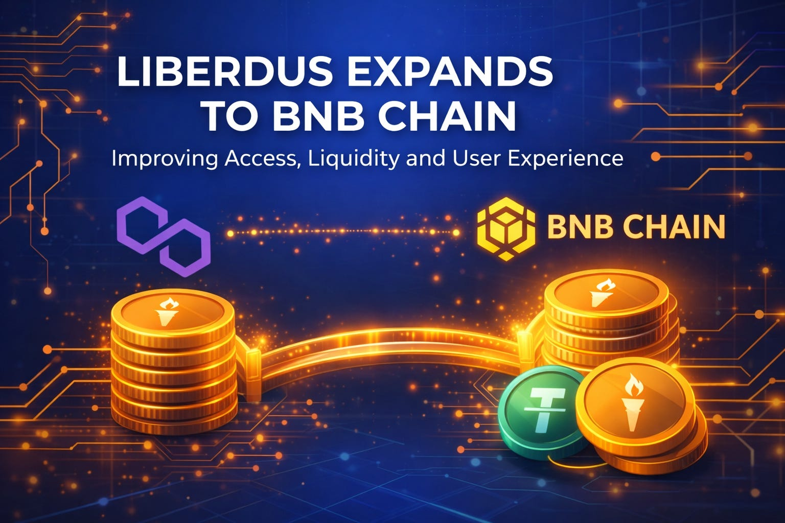

## Why BNB Chain

There were three reasons, in order of weight.

First, **liquidity**. BNB Chain has one of the largest active user bases of any EVM-compatible network, and the depth of stablecoin pairs there is substantially better than on most alternatives. For a protocol like Liberdus — where value is primarily a function of how easily users can get in and out — that depth matters more than almost anything else.

Second, **fees**. The economics of common operations on BNB Chain are an order of magnitude friendlier than on the Ethereum mainnet, and competitive with Polygon for the workloads we care about. This isn't a small detail. A protocol that costs $4 to interact with is fundamentally different from one that costs four cents.

Third, **bridges**. The bridging infrastructure between BNB Chain and the rest of the ecosystem has matured to the point where we feel comfortable recommending it to non-technical users. That wasn't true two years ago. It is now.

## What this means for users

If you hold Liberdus tokens on Polygon, **nothing breaks**. Your existing balances are unaffected, the contracts you're already using continue to work exactly as they did, and we are committed to maintaining Polygon as a first-class home for the protocol indefinitely.

What changes is that you now have *options*:

- You can bridge to BNB Chain to take advantage of deeper liquidity pools.
- You can interact with new BNB-native partners and integrations as they roll out over the next quarter.
- You can hold across both chains, with our official bridge handling the accounting.

The bridge itself is non-custodial and uses a lock-and-mint model audited by [the same firms](#) who reviewed our original deployment. Documentation is available in the [docs portal](#).

> Multi-chain doesn't have to mean fragmented. The goal here is to give the protocol more places to live, not to split the community into camps.

## What's next

This is the first of several network expansions we have planned for the year. The decision-making framework is unchanged: we move when the network is mature enough that we'd be comfortable putting our own funds on it, when the bridging story is clear, and when there is genuine user demand. We don't ship to chains for marketing reasons.

If you have questions, the [community forum](#) is the right place to ask them. The team will be hosting a live AMA next week — details on the [Discord](#).

---

*Welcome to the next chapter. Slowly, carefully, as always.*
