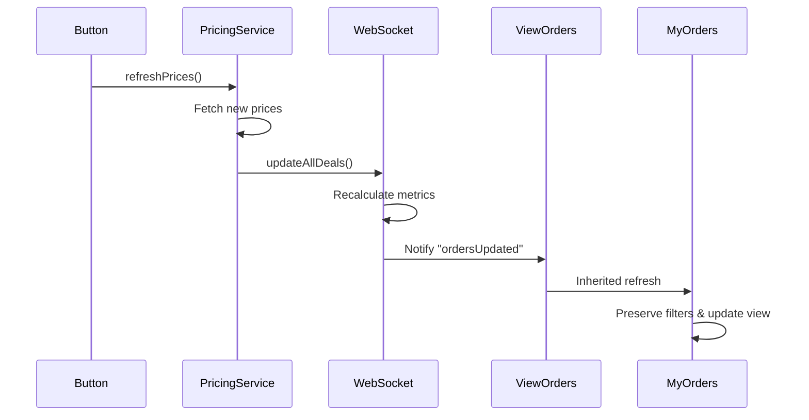

# Refresh Button Implementation

The refresh button in the OTC application triggers a chain of events to update order prices and deal calculations. Here's how it works:

## Overview

When the refresh button is clicked, it:
1. Fetches latest token prices via PricingService
2. Recalculates all deal metrics via WebSocket
3. Updates the UI through ViewOrders/MyOrders subscriptions

## Detailed Flow

### 1. PricingService Update
`PricingService.refreshPrices()` is called and:
```javascript
async refreshPrices() {
    if (this.updating) return this.refreshPromise;
    
    this.updating = true;
    this.notifySubscribers('refreshStart');

    try {
        // 1. Collect token addresses
        const tokenAddresses = new Set();
        // ... collect from orders and NETWORK_TOKENS ...

        // 2. Fetch new prices
        const prices = await this.fetchTokenPrices([...tokenAddresses]);
        
        // 3. Update price cache
        this.prices.clear();
        for (const [address, data] of prices.entries()) {
            this.prices.set(address, data.price);
        }
        
        // 4. Trigger WebSocket update
        await window.webSocket?.updateAllDeals();
        
        // 5. Notify subscribers
        this.notifySubscribers('refreshComplete');
    } catch (error) {
        this.notifySubscribers('refreshError', error);
    }
}
```

### 2. WebSocket Update Process
After prices are updated, `WebSocket.updateAllDeals()` is called:
```javascript
async updateAllDeals() {
    if (!window.pricingService) return;

    // Update all orders with new prices
    for (const [orderId, order] of this.orderCache.entries()) {
        const updatedOrder = await this.calculateDealMetrics(order);
        this.orderCache.set(orderId, updatedOrder);
    }

    // Notify subscribers about updates
    this.notifySubscribers("ordersUpdated", Array.from(this.orderCache.values()));
}
```

### 3. ViewOrders Subscription Handling
ViewOrders (parent class) handles both price and WebSocket updates:
```javascript
constructor() {
    // Handle price updates
    this.pricingService.subscribe((event) => {
        if (event === 'refreshComplete') {
            this.refreshOrdersView();
        }
    });

    // Handle WebSocket updates
    window.webSocket?.subscribe("ordersUpdated", () => {
        this.refreshOrdersView();
    });
}
```

### 4. MyOrders Implementation
MyOrders extends ViewOrders and:
- Inherits all subscription handling
- Preserves filter states during refresh
- Maintains checkbox states

## Component Interaction



## Key Methods

- `PricingService.refreshPrices()`: Fetches new token prices
- `WebSocket.updateAllDeals()`: Updates all order calculations
- `ViewOrders.refreshOrdersView()`: Base refresh implementation
- `MyOrders.refreshOrdersView()`: Extended refresh with filter preservation

## Error Handling

The refresh process includes error handling at each step:
- Price fetch failures are logged and retried
- Failed deal calculations preserve previous values
- UI updates gracefully handle missing data

## Caching

To optimize performance:
- Token prices are cached with configurable TTL
- Token details (decimals, symbols) are cached indefinitely
- Deal calculations are cached until next refresh
